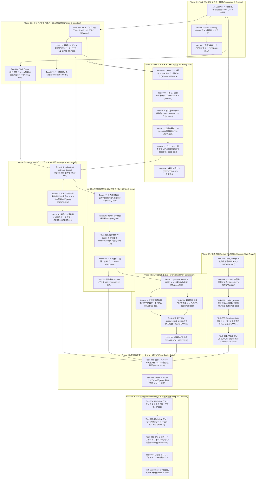

# Spec-Driven Atomic Task List (tasks.md)

> **プロジェクト**: `pdf-quotation-parser-web`  
> **対象フェーズ**: Phase 1〜5 総合（要件・仕様・リスク・トレーサビリティ網羅）  
> **タスク粒度**: 1タスク1コミット検証可能 (Atomic PBI)  
> **状態記法**: `[ ]` (未着手) / `[/]` (進行中) / `[x]` (完了)

---

## 1. 実装フェーズ別ロードマップ (依存関係・優先順序)

---

## 2. Spec-Driven アトミックタスクリスト

### Phase 6.1: Web SPA基盤 & テスト環境 (Foundation & Testbed)
- [x] **Task-001**: [REQ-015/PBI-001] Vite + React 19 + Supabase クライアント初期化
  - **対象**: `package.json`, `src/lib/supabase.ts`, `.env.local`
  - **完了条件 (DoD)**: Supabase URL/Anon Key が `.env.local` から型安全に読み込まれ、クライアントインスタンスがエクスポートされること。
- [x] **Task-002**: [REQ-015/PBI-001] Vitest + React Testing Library テスト基盤セットアップ
  - **対象**: `vite.config.ts`, `src/setupTests.ts`, `package.json`
  - **完了条件 (DoD)**: `npm test` コマンドで Vitest が jsdom 環境で起動し、テストが実行できること。
- [x] **Task-003**: [REQ-013/TEST-001-ENV] 環境変数サニタイズ検証テスト
  - **対象**: `src/lib/supabase.ts`, `src/__tests__/app.test.tsx`
  - **完了条件 (DoD)**: 機密情報やAPIキーのハードコードが存在せず、環境変数未定義時に適切なエラーが送出されること。

### Phase 6.2: クライアントPDFパース & 重複排除 (Parser & Ingestion)
- [x] **Task-004**: [REQ-002/PBI-003/TEST-005-HASH-DUP] Web Crypto SHA-256 ハッシュ計算 & 重複判定ロジック
  - **対象**: `src/lib/hash.ts`, `src/__tests__/hash.test.ts`
  - **完了条件 (DoD)**: 同一PDFバイナリから常に一意な64文字の16進数ハッシュが得られ、単体テストがPASSすること。
- [x] **Task-005**: [REQ-003/REQ-016/PBI-002] pdf.js によるブラウザ内メモリテキスト抽出
  - **対象**: `src/App.tsx`
  - **完了条件 (DoD)**: Worker経由でPDFバイナリがブラウザメモリ上でのみ展開され、全ページのテキストが抽出されること（サーバー送信なし）。
- [x] **Task-006**: [REQ-003/SPEC-004/SPEC-005] 見積ヘッダー・明細の正規化・パースモジュール実装
  - **対象**: `src/lib/parser.ts`
  - **完了条件 (DoD)**: テキストから見積番号、日付、宛名、合計金額、明細行（品名、数量、単価、金額）を型安全に抽出できること。
- [x] **Task-007**: [REQ-003/TEST-003-PDF-PARSE] パーサー単体テストの実装
  - **対象**: `src/__tests__/parser.test.ts`
  - **完了条件 (DoD)**: サンプル見積テキストを入力し、ヘッダーおよび複数明細行が期待通り抽出されるテストがPASSすること。

### Phase 6.3: UI/UX & ガードレール実装 (UI & Safeguards)
- [x] **Task-008**: [REQ-005/Phase 4 TECH-001] D&Dドロップ領域 & 5MBサイズ上限ガード
  - **対象**: `src/App.tsx`
  - **完了条件 (DoD)**: ドロップゾーンUIが配置され、5MB超のファイルがクライアントサイドで即時リジェクトされること。
- [x] **Task-009**: [Phase 4 TECH-002] スキャン画像PDF検知 & エラーUIガード
  - **対象**: `src/App.tsx`
  - **完了条件 (DoD)**: 抽出テキスト長が30文字未満の場合に「スキャン画像PDF非対応」エラーが表示され、DB処理へ遷移しないこと。
- [x] **Task-010**: [Phase 4 UX-001] 未保存データの離脱防止 `beforeunload` フック
  - **対象**: `src/App.tsx`
  - **完了条件 (DoD)**: パース結果が存在し未保存の状態でタブ閉じ・リロードを行った際、ブラウザの離脱警告が表示されること。
- [x] **Task-011**: [REQ-018/PBI-004] 全操作可能要素への `data-ai-id` 属性完全付与
  - **対象**: `src/App.tsx`
  - **完了条件 (DoD)**: Phase 2 第4項で定義された全Kebab-case ID（`pdf-upload-dropzone`, `btn-parse-pdf`, `btn-save-to-db` 等）が付与されていること。
- [x] **Task-012**: [REQ-004/PBI-004] プレビュー・修正グリッド (行追加・行削除・金額再計算)
  - **対象**: `src/App.tsx`
  - **完了条件 (DoD)**: ヘッダー各項目および明細行の編集、行追加、行削除、および数量/単価変更時の金額・合計金額自動再計算が動作すること。
- [x] **Task-013**: [REQ-018/TEST-008-AI-ID-CHECK] UI要素および `data-ai-id` 検証テスト
  - **対象**: `src/__tests__/app.test.tsx`
  - **完了条件 (DoD)**: 主要UI要素に `data-ai-id` が正しく割り振られていること、および非保存案内文が表示されていることを検証するテストがPASSすること。

### Phase 6.4: Supabaseトランザクション永続化 (Storage & Persistence)
- [x] **Task-014**: [REQ-006/SPEC-004/SPEC-005/SPEC-006] estimates / estimate_items / import_logs 永続化
  - **対象**: `src/App.tsx` (`saveToDb`)
  - **完了条件 (DoD)**: 確認済み見積データが `estimates`、`estimate_items`、`import_logs` へ正規化されて保存されること。
- [x] **Task-015**: [REQ-001/REQ-016] PDFクラウド非保存ポリシー案内UI & メモリ内破棄検証
  - **対象**: `src/App.tsx`
  - **完了条件 (DoD)**: 画面上にPDFクラウド非保存ポリシーが常時表示され、PDFバイナリがクラウドストレージへ送信されないこと。
- [x] **Task-016**: [REQ-002/REQ-006/TEST-005/TEST-006] 永続化 & 重複抑止のモック結合テスト
  - **対象**: `src/__tests__/app.test.tsx`
  - **完了条件 (DoD)**: Supabaseクライアントをモック化し、重複ハッシュ検知時のブロックおよび正常保存が検証されること。

### Phase 6.5: 過去単価検索 & 買い物かご (Cart & Price History)
- [x] **Task-017**: [REQ-007/PBI-005] 過去単価検索 & 全角/半角カナ・英数表記揺れ吸収ロジック
  - **対象**: `src/lib/search.ts`
  - **完了条件 (DoD)**: 半角カナ、全角カナ、ひらがなのバリアントを生成し、`estimate_items` から該当する過去単価履歴を取得できること。
- [x] **Task-018**: [REQ-007/PBI-005] 過去単価検索UI & 単価推移比較表示
  - **対象**: `src/components/PriceSearch.tsx`, `src/App.tsx`
  - **完了条件 (DoD)**: キーワード入力により過去の採用単価・見積日・取引先推移を一覧表示できること。
- [x] **Task-019**: [REQ-008/PBI-005/Phase 4 UX-002] 買い物かご (Cart) 状態管理 & sessionStorage 同期
  - **対象**: `src/lib/cart.ts`
  - **完了条件 (DoD)**: 複数検索結果の明細をカートへストックし、ブラウザリロード時にも `sessionStorage` から状態が復元されること。
- [x] **Task-020**: [REQ-008/PBI-005] カート確認ドロワー/モーダル & 数量調整UI
  - **対象**: `src/components/CartDrawer.tsx`
  - **完了条件 (DoD)**: カート内の部材一覧確認、数量変更、削除、および帳票作成への引き継ぎができること。
- [x] **Task-021**: [TEST-009-SEARCH-FUZZY/TEST-010-CART-STATE] 単価検索 & カート機能の自動テスト
  - **対象**: `src/__tests__/search.test.ts`, `src/__tests__/cart.test.ts`
  - **完了条件 (DoD)**: 表記揺れ検索ヒット率およびカート追加・削除・合算の全テストケースがPASSすること。

### Phase 6.6: 日本語帳票生成エンジン (Client PDF Generation)
- [x] **Task-022**: [REQ-009/REQ-010/PBI-006] pdf-lib + fontkit 日本語フォント埋め込み基盤
  - **対象**: `src/lib/pdfGenerator.ts`
  - **完了条件 (DoD)**: ブラウザ上でNoto Sans JP等の日本語フォントを埋め込み、文字化けなく日本語PDFを動的生成できること。
- [x] **Task-023**: [REQ-009/SPEC-008] 新規御見積依頼書PDF生成ロジック (`ESTIMATE_REQUEST`)
  - **対象**: `src/lib/pdfGenerator.ts`
  - **完了条件 (DoD)**: 金額非表示、回答期限・見積条件枠、明細テーブルを含む御見積依頼書PDFバイナリをブラウザ上でダウンロード生成できること。
- [x] **Task-024**: [REQ-010/SPEC-008] 新規御発注書PDF生成ロジック (`PURCHASE_ORDER`)
  - **対象**: `src/lib/pdfGenerator.ts`
  - **完了条件 (DoD)**: 税抜合計発注金額の下線強調、単価・金額明細、インボイス備考を含む御発注書PDFバイナリを動的生成できること。
- [x] **Task-025**: [REQ-011/SPEC-008] アウトバウンド発行履歴 (`procurement_projects`) 保存 & 履歴一覧UI
  - **対象**: `src/components/OutboundHistory.tsx`
  - **完了条件 (DoD)**: 発行された依頼書・発注書のメタデータがDBに記録され、一覧画面から再確認できること。
- [x] **Task-026**: [TEST-011-PDF-GEN-REQ/TEST-012-PDF-GEN-PO] 日本語帳票生成の自動テスト
  - **対象**: `src/__tests__/pdfGenerator.test.ts`
  - **完了条件 (DoD)**: 依頼書および発注書のPDFバイナリがエラーなく生成され、受領基準を満たすこと。

### Phase 6.7: マスタ管理 & Auth/RLS基盤 (Master & Multi-Tenant)
- [x] **Task-027**: [REQ-012/SPEC-002/PBI-007] `user_settings` 自社企業設定管理画面
  - **対象**: `src/components/SettingsModal.tsx`
  - **完了条件 (DoD)**: 自社名、住所、TEL/FAX、担当者情報をSupabase `user_settings` テーブルとCRUD連携できること。
- [x] **Task-028**: [REQ-012/SPEC-003/PBI-007] `suppliers` 取引先商社マスタCRUD画面
  - **対象**: `src/components/SupplierMaster.tsx`
  - **完了条件 (DoD)**: 商社名、担当者姓名、メールアドレスの追加・編集・論理削除ができること。
- [x] **Task-029**: [REQ-014/SPEC-007] `product_master` 未登録製品の同期ロジック
  - **対象**: `src/lib/productMaster.ts`
  - **完了条件 (DoD)**: 帳票作成・パース時に未登録のメーカー・型番が自動または手動で製品マスタに蓄積されること。
- [x] **Task-030**: [REQ-017/SPEC-001/Phase 4 SEC-001] Supabase Auth ログイン・セッション管理 & RLS 検証
  - **対象**: `src/components/AuthModal.tsx`
  - **完了条件 (DoD)**: メール/パスワード認証によるセッション確立と、他テナントデータの閲覧・更新が拒否されること。
- [x] **Task-031**: [TEST-013-SETTINGS-CRUD] 設定・マスタ管理の自動テスト
  - **対象**: `src/__tests__/settings.test.ts`
  - **完了条件 (DoD)**: `user_settings` および `suppliers` のCRUD操作がPASSすること。

### Phase 6.8: 総合品質ゲート & リリース判定 (Final Quality Gate)
- [x] **Task-032**: 全テストスイート一括実行 & ビルド整合性検証
  - **対象**: プロジェクト全域
  - **完了条件 (DoD)**: `npm test`（全ユニット/コンポーネントテストPASS）および `npx tsc -b`（型エラー0件）を達成すること。
- [x] **Task-033**: Phase 5 トレーサビリティ検証 (RTM) 最終更新 & ゲート判定
  - **対象**: `docs/Phase5_トレーサビリティ検証.md`
  - **完了条件 (DoD)**: 全MUST/SHOULD要件の充足状態が FULL (PASS) となり、最終品質ゲート判定が PASS となること。

### Phase 6.9: PDF抽出結果Markdown出力 & AI連携基盤 (Loop 22 / PBI-008)
- [x] **Task-034**: [Loop 22/PBI-008/Phase 4 SEC-002] Markdownフォーマッタ & サニタイズ・マスキング実装
  - **対象**: `src/lib/markdownFormatter.ts`
  - **完了条件 (DoD)**:
    1. パース結果（ヘッダー情報、抽出プレビュー、修正後明細一覧）をAIエージェント向け構造化Markdown（Markdown表・セクション分割）に変換する関数 `formatQuotationToMarkdown` を実装。
    2. 個人名・取引先担当者名・メール等の機密情報項目を `[MASKED]` 等へ置換するマスキングオプション（デフォルト有効）を実装。
    3. Markdown制御文字（`|`, \` 等）をエスケープし、レイアウト破壊・インジェクションを抑止。
    4. 欠損・未定義プロパティが存在してもクラッシュしないNull安全性を担保。
- [x] **Task-035**: [Loop 22/PBI-008/TEST-014-MD-EXPORT] Markdownフォーマッタ単体テスト
  - **対象**: `src/__tests__/markdownFormatter.test.ts`
  - **完了条件 (DoD)**:
    1. 正常系パース結果からのMarkdown生成テストがPASSすること。
    2. 機密情報のマスキング機能検証テストがPASSすること。
    3. Markdown制御文字のエスケープ処理検証テストがPASSすること。
    4. 欠損データ（null/undefined項目）時の安全な文字列生成テストがPASSすること。
- [x] **Task-036**: [Loop 22/PBI-008/Phase 4 UX-003] クリップボードコピー & フォールバックUI実装
  - **対象**: `src/App.tsx`
  - **完了条件 (DoD)**:
    1. パース結果確認エリアに `data-ai-id="btn-copy-markdown"` を持つ「📋 AI用マークダウン出力」ボタンを配置。
    2. ボタン押下時に `formatQuotationToMarkdown` を実行し、`navigator.clipboard.writeText` でクリップボードに転送。
    3. クリップボードAPI失敗（パーミッション拒否・非HTTPS）時の `document.execCommand('copy')` / テキストエリアフォールバック処理を実装。
    4. コピー成功時（トーストまたはメッセージ表示）および失敗時の視覚的フィードバックを提供。
- [x] **Task-037**: [Loop 22/PBI-008/TEST-014-MD-EXPORT] UI統合 & クリップボードコピー自動テスト
  - **対象**: `src/__tests__/app.test.tsx`
  - **完了条件 (DoD)**:
    1. `btn-copy-markdown` ボタンがDOMに描画されていることを検証。
    2. ボタンクリック時にクリップボード関数が呼び出され、正常に通知が表示されることを検証。
    3. テストがオールグリーンでPASSすること。
- [x] **Task-038**: [Loop 22/総合検証] Phase 6.9 総合品質ゲート検証 (Build & Test)
  - **対象**: プロジェクト全域
  - **完了条件 (DoD)**:
    1. `npm test`（既存22テスト + 新規テスト全件PASS）を確認。
    2. `npm run build`（`tsc -b && vite build`）がエラー0で成功すること。
    3. `tasks.md` および `Phase5_トレーサビリティ検証.md` のステータスを更新可能な状態にすること。

---

## 3. 各タスクの検証・テスト手順 (DoDチェックリスト)

| タスクID | 主対象コンポーネント | 検証コマンド / テスト手順 | 期待結果 (受入基準) |
| :--- | :--- | :--- | :--- |
| **Task-001〜Task-003** | `src/lib/supabase.ts`, `.env.local` | `npm test -- src/__tests__/app.test.tsx` | Supabaseクライアントの初期化および環境変数読み込みが正常動作すること |
| **Task-004** | `src/lib/hash.ts` | `npm test -- src/__tests__/hash.test.ts` | `TEST-005-HASH-DUP`: SHA-256一意性・固定長64文字のテストがPASSすること |
| **Task-005〜Task-007** | `src/lib/parser.ts` | `npm test -- src/__tests__/parser.test.ts` | `TEST-003-PDF-PARSE`: 見積ヘッダー・明細行の構造化パースがPASSすること |
| **Task-008〜Task-013** | `src/App.tsx` | `npm test -- src/__tests__/app.test.tsx` | `TEST-008-AI-ID-CHECK`: data-ai-id付与、ポリシー案内文表示がPASSすること |
| **Task-014〜Task-016** | `src/App.tsx` (`saveToDb`) | `npm test` & UIモック検証 | `estimates`, `estimate_items`, `import_logs` への正規化保存が正常完了すること |
| **Task-017〜Task-021** | `src/lib/search.ts`, `cart.ts` | `npm test -- src/__tests__/cart.test.ts` | `TEST-009/010`: カナ揺れ吸収検索およびカートの保持・削除がPASSすること |
| **Task-022〜Task-026** | `src/lib/pdfGenerator.ts` | `npm test -- src/__tests__/pdfGenerator.test.ts` | `TEST-011/012`: 日本語見積依頼書・発注書PDFの出力がPASSすること |
| **Task-027〜Task-031** | 各種マスタコンポーネント | `npm test -- src/__tests__/settings.test.ts` | `TEST-013`: 自社設定・取引先マスタのDB CRUDがPASSすること |
| **Task-032〜Task-033** | プロジェクト全体 | `npm test && npx tsc -b` | 全テストスイートがPASSし、TypeScriptビルドがエラー0で完了すること |
| **Task-034〜Task-035** | `src/lib/markdownFormatter.ts` | `npm test -- src/__tests__/markdownFormatter.test.ts` | `TEST-014-MD-EXPORT`: Markdownフォーマット、マスキング、サニタイズ検証が全件PASSすること |
| **Task-036〜Task-037** | `src/App.tsx` | `npm test -- src/__tests__/app.test.tsx` | `btn-copy-markdown` の描画およびクリップボードコピー発火・通知検証がPASSすること |
| **Task-038** | プロジェクト全体 | `npm run build && npm test` | ビルド成功、全テストスイートPASS、リグレッション0件を確認 |

---

## 4. リスク・エッジケース対策タスク (Phase 4での壁打ち反映)

| Phase 4 指摘リスク | 深刻度 | 対策タスクID | 具体的実装・ガードレール仕様 |
| :--- | :--- | :--- | :--- |
| **巨大PDFによるブラウザOOMクラッシュ** | **High** | **Task-008** | ファイル選択時に5MBの上限を設け、超過時はクライアントサイドで即時リジェクトしブラウザクラッシュを防止。 |
| **スキャン画像PDFによるパース破綻** | **High** | **Task-009** | 抽出テキスト長が30文字未満の場合に「画像PDF非対応」エラーを表示し、不正なDB保存を未然に防止。 |
| **重複ハッシュのレースコンディション** | **High** | **Task-004 / Task-014** | 事前SELECTによる重複チェックに加え、DB側の `file_hash` UNIQUE制約エラーをキャッチして安全にUIへ返却。 |
| **RLS設定不備による他テナントデータ漏洩** | **Critical** | **Task-030** | Supabase PostgreSQL において全テーブルに `auth.uid() = user_id` を強制し、他テナントアクセスを遮断。 |
| **編集中データの誤離脱による喪失** | **High** | **Task-010** | `beforeunload` イベントフックにより、未保存データが存在する場合のタブ閉じ・リロード時にブラウザ確認警告を表示。 |
| **処理中の多重リクエストによる多重登録** | **High** | **Task-011 / Task-014** | `isProcessing` 状態において「解析」「保存」ボタンを `disabled` 化し、物理的な多重クリックを完全ブロック。 |
| **カート状態の揮発（F5リロードによる消失）** | **High** | **Task-019** | カート明細配列を `sessionStorage` に自動同期し、ページ再読込時にも選択状態を自動リストア。 |
| **機密情報の外部AIへの意図せぬ流出** | **Critical** | **Task-034** | Markdown出力時に担当者氏名・メールアドレス等を `[MASKED]` に自動置換し、AIプロンプトへの平文漏洩を防止。 |
| **Markdownインジェクションによるレイアウト破壊** | **High** | **Task-034** | 抽出テキスト内の `|` や \` 等のMarkdown制御文字をサニタイズ・エスケープし、AI解釈時のテーブル崩壊を抑止。 |
| **クリップボード権限エラーのサイレントフェイラー** | **High** | **Task-036** | `writeText()` 拒否時の `execCommand('copy')` フォールバックおよびコピー成否の視覚的トースト通知を整備。 |
| **欠損・未定義データによるフォーマッタクラッシュ** | **High** | **Task-034 / Task-035** | オプショナルチェーンとNull合体演算子を網羅し、一部項目欠損時にも空文字として安全にMarkdownを生成。 |
