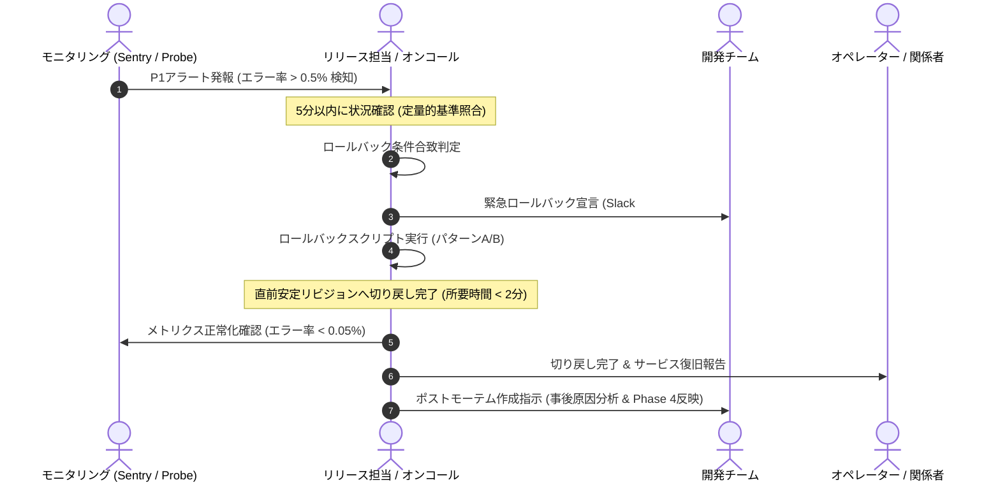

# Phase 11 リリース指示・監視運用 (Release Instructions & Monitoring / Operations)

本ドキュメントは、`pdf-quotation-parser-web`（Production: `v1.0.0-loop2`）における本番リリース手順、CI/CD自動化パイプライン設計、SLO/SLA監視および定量的アラート設計、ならびに障害発生時の切り戻し（Rollback）Runbookを定義した authoritative 仕様書です。

---

## 1. リリース手順 & チェックリスト

### 1.1 リリース前事前準備チェックリスト (Pre-flight Checklist)
リリース作業前に以下の全項目が確認されている必要があります。

- [ ] **静的解析・型検査**: `npm run lint` および `npx tsc --noEmit` が警告・エラー0件で通過していること。
- [ ] **全自動テスト実行**: `npm test`（Vitest 13ファイル・48テスト）が100%成功（ALL GREEN）であること。
- [ ] **プロダクションビルド**: `npm run build` により `dist/` ディレクトリ配下に `index.html`, アセット, `pdf.worker` が正常生成されること。
- [ ] **環境変数設定**:
  - `VITE_SUPABASE_URL`: 本番SupabaseプロジェクトURL
  - `VITE_SUPABASE_ANON_KEY`: 本番Supabase Anon公開鍵
  - ※ クライアント完結設計のためサービスロールキー等のシークレットは同梱しないこと。
- [ ] **Supabase RLSポリシー確認**: `user_settings`, `suppliers`, `estimates`, `estimate_items`, `import_logs`, `procurement_projects` の全テーブルで `auth.uid() = user_id` が有効化されていること。

---

### 1.2 CI/CD デプロイパイプライン設計 (GitHub Actions)

GitHub Actionsを利用した完全自動デプロイパイプライン定義（`.github/workflows/deploy.yml` 想定）。

```yaml
name: CI/CD Production Deployment

on:
  push:
    tags:
      - 'v*.*.*'
    branches:
      - main

jobs:
  test-and-build:
    name: Test & Build
    runs-on: ubuntu-latest
    steps:
      - name: Checkout Code
        uses: actions/checkout@v4

      - name: Setup Node.js
        uses: actions/setup-node@v4
        with:
          node-version: 22
          cache: 'npm'

      - name: Install Dependencies
        run: npm ci

      - name: Lint Check
        run: npm run lint

      - name: Type Check
        run: npx tsc --noEmit

      - name: Run Automated Tests
        run: npm test

      - name: Build Production Assets
        env:
          VITE_SUPABASE_URL: ${{ secrets.PROD_SUPABASE_URL }}
          VITE_SUPABASE_ANON_KEY: ${{ secrets.PROD_SUPABASE_ANON_KEY }}
        run: npm run build

      - name: Upload Build Artifacts
        uses: actions/upload-artifact@v4
        with:
          name: dist-artifacts
          path: dist/
          retention-days: 7

  deploy-production:
    name: Deploy to Static Hosting (e.g., Cloudflare Pages / Vercel)
    needs: test-and-build
    runs-on: ubuntu-latest
    if: startsWith(github.ref, 'refs/tags/v') || github.ref == 'refs/heads/main'
    steps:
      - name: Download Build Artifacts
        uses: actions/download-artifact@v4
        with:
          name: dist-artifacts
          path: dist

      - name: Deploy to Hosting Provider
        id: deploy
        run: |
          echo "Deploying dist/ to production hosting..."
          # 例: npx wrangler pages deploy dist --project-name=pdf-quotation-parser-web --branch=main
          # または Vercel CLI / Supabase Hosting
          echo "DEPLOY_STATUS=SUCCESS" >> $GITHUB_ENV

      - name: Run Post-Deploy Smoke Test
        run: |
          echo "Running automated smoke test..."
          curl -f -I https://quotation-parser.example.com/ || exit 1
```

---

### 1.3 本番リリース直後スモークテスト (Smoke Test Runbook)

デプロイ完了後、直ちに以下の5ステップを本番URLに対して実施する。

| No | テスト項目 | 操作手順 | 期待結果・判定基準 |
| :--- | :--- | :--- | :--- |
| **ST-01** | SPA静的配信 & CSP | 本番トップページへアクセス | HTTP 200返却、白画面クラッシュなし、コンソールCSP違反0件 |
| **ST-02** | Supabase Auth認証 | ログインモーダルを開き、テストアカウントでログイン | セッションが正常確立され、ユーザー名・会社名が表示されること |
| **ST-03** | PDFローカル解析 | テスト用見積書PDF（岩瀬産業フォーマット）をD&D | 1.5秒以内に明細グリッドにパース展開されること（サーバー送信なし） |
| **ST-04** | カート手入力 & 帳票作成 (Loop 2) | カートを開き「手入力」タブで品名・数量・単位「個」を入力し「見積依頼書PDF作成」を押下 | モーダルが開き、宛先入力ガードが作動。宛先入力後に正常に日本語PDFがダウンロードされること |
| **ST-05** | 監査ログ記録 (REQ-13-002) | 帳票作成後にローカル監査ログ / コンソールを確認 | `recordDocumentExportAudit` が発火し、実データを含まないメタデータが記録されること |

---

## 2. 監視・アラート設計 (Monitoring & Alerting)

### 2.1 サービスレベル目標 (SLO / SLA)

| メトリクス区分 | 指標名 | SLO目標値 (月間) | SLA保証値 |
| :--- | :--- | :--- | :--- |
| **可用性 (Availability)** | 静的ホスティング稼働率 (HTTP 2xx/3xx) | **99.95% 以上** | 99.90% |
| **描画速度 (LCP)** | Largest Contentful Paint (初回描画) | **1.8秒以内** (p90) | 2.5秒以内 |
| **パース性能 (Latency)** | クライアントPDF解析処理時間 (1〜5ページ) | **1.5秒以内** (p95) | 3.0秒以内 |
| **エラー率 (Error Rate)** | フロントエンド未処理例外 (Sentry / Datadog) | **0.05% 未満** (PV比) | 0.20% 未満 |
| **BaaS可用性 (BaaS Health)** | Supabase REST API応答率 (Auth/DB) | **99.90% 以上** | 99.50% |

---

### 2.2 監視メトリクス & 定量的アラート閾値

観測可能性ツール（Sentry, Datadog RUM, Pingdom / UptimeRobot）を想定した定量的監視トリガー。

```mermaid
flowchart TD
    SPA["Web Browser (Client SPA)"] -->|Error Traces / Performance| Sentry["Sentry / Datadog RUM"]
    Probe["External Probe (Uptime)"] -->|HTTPS Probe (60s)| Cloudflare["Static Edge Hosting"]
    Cloudflare --> SPA
    SPA -->|REST / GraphQL| SupabaseAPI["Supabase Postgres (BaaS)"]
    SupabaseAPI -->|Metrics| SupabaseDashboard["Supabase Health Metrics"]

    Sentry -->|Threshold Breached| PagerDuty["Alertmanager (Slack / PagerDuty)"]
    Probe -->|HTTP 5xx > 1%| PagerDuty
    SupabaseDashboard -->|Connection Pool > 80%| PagerDuty
```

#### アラートルール・閾値マトリクス

| アラート識別子 | 監視対象項目 | 監視間隔 | 警告閾値 (Warning) | 致命的障害閾値 (Critical) | 通知先 & 対応優先度 |
| :--- | :--- | :--- | :--- | :--- | :--- |
| **ALT-AVAIL-01** | ホスティング死活監視 (HTTP Status) | 1分毎 | 1回タイムアウト / 5xx | 連続2回 5xx (HTTPエラー率 > 1%) | PagerDuty (P1 / 即時電話・SMS) |
| **ALT-ERR-01** | クライアント未処理例外率 (JS Errors) | 5分集計 | 0.1% 超過 / 5分 | **0.5% 超過 / 5分** (新バージョン集中) | PagerDuty (P1 / 即時Rollback検討) |
| **ALT-PDF-01** | PDFパース失敗率 (`parser.ts`) | 5分集計 | パース失敗 > 3% | **パース失敗 > 10%** | Slack #alerts-high (P2) |
| **ALT-AUTH-01** | Supabase Auth認証失敗スパイク | 5分集計 | 認証エラー > 5% | 認証エラー > 15% | Slack #alerts-high (P2) |
| **ALT-PERF-01** | クライアントPDF生成レイテンシ (`pdf-lib`) | 15分集計 | p95 > 2.5秒 | p95 > 4.0秒 | Slack #alerts-warn (P3) |

---

### 2.3 通知ルール & エスカレーションマトリクス

1. **Critical (P1)**:
   - 対象: 全面アクセス不能、未処理JSエラー率 > 0.5%、デプロイ直後の白画面多発。
   - 通知先: PagerDuty自動エスカレーション、オンコール担当者へ自動音声通話・SMS、Slack `#incident-critical`。
   - 応答SLA: **15分以内**に一次対応（ロールバック要否判断）。
2. **Warning (P2 / P3)**:
   - 対象: 単一機能（PDF生成・検索）の遅延、軽微なUI不整合。
   - 通知先: Slack `#alerts-prod`。
   - 応答SLA: 4営業時間以内に対処方針確定。

---

## 3. 切り戻し（Rollback）手順 & 障害対応 Runbook

### 3.1 定量的ロールバック発動トリガー (主観的判断の完全排除)

デプロイ完了から **60分以内** に以下の定量的条件のいずれか1つを満たした場合、**協議を待たずに即時ロールバックを発動**する。

> [!CAUTION]
> **即時ロールバック発動条件 (Hard Criteria)**:
> 1. **未処理JavaScript例外率**: 本番リリース後、クライアントエラー率が **0.5%** を超過した場合。
> 2. **スモークテスト重大項目失敗**: ST-01〜ST-04 のいずれかにおいて、クラッシュまたは操作不能が発生した場合。
> 3. **HTTP 5xxエラー率**: 静的ホスティングまたはEdgeでのエラー率が **1.0%** を超過した場合。
> 4. **Supabase RLSアクセス拒否スパイク**: 正常ユーザーのクエリがRLSポリシー不整合により連続して403/Access Deniedとなった場合。

---

### 3.2 ロールバック実行コマンド・スクリプト (Automated Rollback)

#### パターンA: ホスティングプロバイダによる即時リビジョン切戻し (所要時間: 1分未満)

ホスティング側（Cloudflare Pages / Vercel）で直前の正常デプロイIDへ即時切り戻す。

```bash
# 1. Cloudflare Pages の場合: 直前の安定デプロイメントをアクティブ化
npx wrangler pages deployment rollback --project-name=pdf-quotation-parser-web --deployment-id=<PREVIOUS_STABLE_DEPLOYMENT_ID>

# 2. Vercel の場合: 直前安定エイリアスへプロモーション
npx vercel alias set <PREVIOUS_STABLE_DEPLOYMENT_URL> quotation-parser.example.com
```

#### パターンB: Gitタグ / コミットRevert による自動CI/CD切り戻し (所要時間: 3〜5分)

```bash
# 1. ロールバック用緊急ブランチを作成
git checkout -b rollback/v1.0.0-loop2

# 2. 直前の問題コミットをRevert
git revert HEAD -m 1 --no-edit

# 3. ロールバックタグを発行してプッシュ (CI/CDが自動ビルド & デプロイ)
git push origin rollback/v1.0.0-loop2
git tag -a v1.0.0-loop2-rollback -m "Emergency Rollback to previous stable state"
git push origin v1.0.0-loop2-rollback
```

---

### 3.3 障害対応・エスカレーションフロー (Incident Management)



---

## 4. Loop 2 リリース・運用監視差分

### 4.1 Loop 2 (新規手入力・帳票作成) に伴う特有の監視観点
- **ブラウザローカルストレージ監視**:
  - `localStorage`（下書きデータ保存キー: `pdf_quotation_new_cart_draft`）のQuataExceededError（容量制限エラー）の発生有無をSentryでトラッキング。
- **インメモリ完結の担保**:
  - 手入力明細（`isManualEntry: true`）のPDF生成時に、バックエンドDB（`procurement_projects` / `estimates`）への不正なINSERTトラフィックが発生していないことをログ監査で担保。
- **クライアントフォント埋め込み負荷**:
  - `pdf-lib` + `@pdf-lib/fontkit` による手入力明細PDF生成時のCPUスパイク・フリーズの有無（Long Task > 50ms）を監視。
