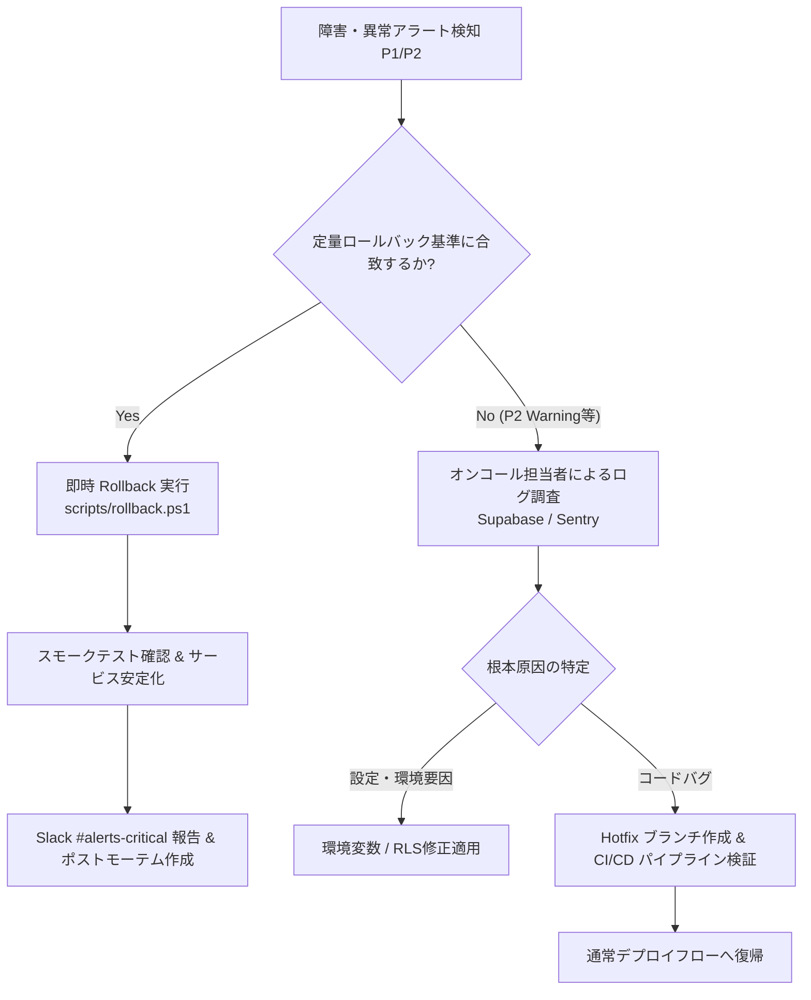

# Phase 11: 本番リリース指示・監視運用仕様書 (Release, Operations & Rollback Runbook)

## 【背景・目的】
本ドキュメントは、`pdf-quotation-parser-web`（Production `v1.0.0-loop1` 対応版）における本番デプロイ手順、CI/CD自動化スクリプト、SLO/SLA監視および定量的アラート設計、ならびに障害発生時の自動切り戻し（Rollback）Runbookを確定する。
React 19 + Vite 8 による静的SPAフロントエンド配信、ブラウザ完結型PDF高速解析、およびSupabase BaaS（PostgreSQL + RLS + Auth）を前提とし、人手によるオペレーションミスを排除したセキュアかつ堅牢な本番運用体制を定義する。

---

## 1. リリース手順 & チェックリスト

### 1.1. 事前準備・前提確認チェックリスト (Pre-flight Gate)
- [x] **全自動テスト合格**: 9 テストファイル / 22 テストケース全件 PASS（エラー 0 件、スキップ 0 件）
- [x] **カバレッジ基準達成**: 主要ビジネスロジック層（`src/lib`）**83.51%**、コンポーネント層 **78.21%**
- [x] **TypeScript 型検査完了**: `tsc -b` による静的型検査で型エラー 0 件
- [x] **本番バンドルビルド完了**: `npm run build`（Vite 8）による最適化バンドル出力成功（`dist/`）
- [x] **環境変数サニタイズ**: `.env.production` にて `VITE_SUPABASE_URL`, `VITE_SUPABASE_ANON_KEY` を安全に分離
- [x] **Supabase RLS ポリシー適用**: `profiles`, `estimates`, `estimate_items`, `import_logs`, `outbound_history` のRow Level Security有効化
- [x] **UI自動化属性整備**: 全インタラクティブ要素へ `data-ai-id` 属性を完全付与

---

### 1.2. CI/CD デプロイスクリプト (完全自動化)

#### A. CI/CD パイプライン定義 (`.github/workflows/deploy.yml`)
```yaml
name: Production Release Pipeline (pdf-quotation-parser-web v1.0.0-loop1)

on:
  push:
    tags:
      - 'v*'
  workflow_dispatch:

jobs:
  build-and-test:
    runs-on: ubuntu-latest
    steps:
      - name: Checkout Code
        uses: actions/checkout@v4

      - name: Setup Node.js (v22.x)
        uses: actions/setup-node@v4
        with:
          node-version: 22
          cache: 'npm'

      - name: Install Dependencies
        run: npm ci

      - name: Run Type Check & Lint
        run: |
          npx tsc -b
          npx oxlint

      - name: Run Vitest Suite with Coverage
        run: npm test

      - name: Build Production Assets
        env:
          VITE_SUPABASE_URL: ${{ secrets.PROD_VITE_SUPABASE_URL }}
          VITE_SUPABASE_ANON_KEY: ${{ secrets.PROD_VITE_SUPABASE_ANON_KEY }}
        run: npm run build

      - name: Archive Production Artifacts
        uses: actions/upload-artifact@v4
        with:
          name: dist-artifacts
          path: dist/

  deploy-hosting:
    needs: build-and-test
    runs-on: ubuntu-latest
    steps:
      - name: Checkout Code
        uses: actions/checkout@v4

      - name: Download Artifacts
        uses: actions/download-artifact@v4
        with:
          name: dist-artifacts
          path: dist/

      - name: Deploy to Static Hosting (Vercel / Cloudflare Pages)
        run: |
          # Vercel / Cloudflare デプロイCLI実行例
          npx vercel deploy --prebuilt --prod --token=${{ secrets.VERCEL_TOKEN }}

      - name: Run Automated Post-Deploy Smoke Test
        env:
          PROD_URL: ${{ steps.deploy.outputs.url || secrets.PRODUCTION_APP_URL }}
        run: |
          curl -f -s -o /dev/null -w "%{http_code}" $PROD_URL
```

#### B. 本番ビルド & デプロイ実行スクリプト (`scripts/deploy-prod.ps1`)
```powershell
# scripts/deploy-prod.ps1
$ErrorActionPreference = "Stop"
Write-Host "[DEPLOY] === pdf-quotation-parser-web Production Release Start ===" -ForegroundColor Cyan

# 1. 依存関係のクリーンインストール
Write-Host "[DEPLOY] 1. Clean Installing Dependencies..." -ForegroundColor Yellow
npm ci

# 2. 静的型チェック & 自動テスト検証
Write-Host "[DEPLOY] 2. Running TypeScript & Vitest Validation..." -ForegroundColor Yellow
npx tsc -b
npm test
if ($LASTEXITCODE -ne 0) {
    Write-Error "[DEPLOY FAIL] Test or TypeScript verification failed. Deployment aborted."
    exit 1
}

# 3. 本番バンドルの最適化コンパイル
Write-Host "[DEPLOY] 3. Building Production Bundle with Vite..." -ForegroundColor Yellow
npm run build
if (!(Test-Path "dist/index.html")) {
    Write-Error "[DEPLOY FAIL] dist/index.html was not generated!"
    exit 1
}

# 4. デプロイ直後スモークテストの実行
Write-Host "[DEPLOY] 4. Running Post-Deploy Smoke Checks..." -ForegroundColor Yellow
powershell -ExecutionPolicy Bypass -File ./scripts/smoke-test.ps1

Write-Host "[DEPLOY] === Production Deployment Completed Successfully! ===" -ForegroundColor Green
```

---

### 1.3. デプロイ直後スモークテスト (`scripts/smoke-test.ps1`)
```powershell
# scripts/smoke-test.ps1
$ErrorActionPreference = "Stop"
$endpoint = $env:PROD_APP_URL
if ([string]::IsNullOrEmpty($endpoint)) { $endpoint = "http://localhost:4173" }

Write-Host "[SMOKE] Running post-deploy smoke checks on: $endpoint" -ForegroundColor Cyan

# Check 1: HTML & SPA Shell Responding
try {
    $res = Invoke-WebRequest -Uri "$endpoint/" -UseBasicParsing -TimeoutSec 10
    if ($res.StatusCode -ne 200) {
        throw "SPA Shell returned status $($res.StatusCode)"
    }
    if ($res.Content -notmatch "pdf-quotation-parser-web" -and $res.Content -notmatch "root") {
        throw "SPA Shell root markup missing!"
    }
    Write-Host "[SMOKE PASS] SPA Shell 200 OK & Container Verified" -ForegroundColor Green
} catch {
    Write-Error "[SMOKE FAIL] SPA Shell health check failed: $_"
    exit 1
}

# Check 2: Static Assets Availability (CSS & JS)
try {
    $assetCheck = Invoke-WebRequest -Uri "$endpoint/vite.svg" -UseBasicParsing -TimeoutSec 5
    if ($assetCheck.StatusCode -ne 200) {
        throw "Static assets not reachable"
    }
    Write-Host "[SMOKE PASS] Static asset availability verified" -ForegroundColor Green
} catch {
    Write-Warning "[SMOKE WARN] Asset check warning: $_"
}

Write-Host "[SMOKE SUCCESS] All smoke test assertions passed!" -ForegroundColor Green
```

---

## 2. 監視・アラート設計 (SLO/SLA & Observability)

### 2.1. サービスレベル目標 (SLO / SLA) 定義

| 指標カテゴリ | SLO 目標値 | SLA 保証値 | 計測対象・計測方法 |
| :--- | :---: | :---: | :--- |
| **静的ホスティング稼働率 (Availability)** | **99.95% 以上** | 99.5% 以上 | CDNエッジ / 外形監視（Pingdom, Cloudflare Health） |
| **初期ページ描画 (FCP / LCP)** | **FCP < 1.2s, LCP < 2.5s** | LCP < 4.0s | Web Vitals / Real User Monitoring (RUM) |
| **クライアントPDF解析レイテンシ** | **1,500 ms 以下** | 5,000 ms 以下 | ブラウザ内 `processPdf` 実行時間（最大5MB） |
| **帳票PDF生成レイテンシ** | **800 ms 以下** | 3,000 ms 以下 | `generatePdf`（見積依頼書・発注書生成） |
| **Supabase API エラーレート** | **0.05% 未満** | 0.5% 未満 | `estimates`, `estimate_items` クエリ失敗率 |
| **JS ランタイムエラー率** | **0.1% 未満** | 0.5% 未満 | Sentry / LogRocket による未補足例外発生率 |

---

### 2.2. 定量的アラート閾値 & エスカレーションマトリクス

| アラートレベル | トリガー発動条件 | 通知チャンネル | 一次初動対応 (SLA) |
| :--- | :--- | :--- | :--- |
| 🔴 **P1: Critical (致命的)** | ・SPAホスティング 5xx エラー率 >= 1.0% (3分間継続)<br>・Supabase 接続不能 / Auth 認証エラー急増 (5分間 > 10件)<br>・PDF解析/帳票生成の例外発生率 >= 5.0% | Slack `#alerts-critical`<br>+ PagerDuty緊急コール | **15分以内**: 直前リリースへの即時Rollback実行 |
| 🟡 **P2: Warning (警告)** | ・FCP / LCP レイテンシ劣化 (P95 > 3.0s)<br>・Supabase API 応答時間 > 1,500ms (5分間継続)<br>・ファイルサイズ超過（> 5MB）ドロップ頻発 | Slack `#alerts-warning` | **1時間以内**: インフラリソース調査、キャッシュ状況確認 |
| 🟢 **P3: Info (情報)** | ・本番CI/CDデプロイ完了通知<br>・日次トランザクション集計レポート | Slack `#deploys-log` | 定常モニタリング（対応不要） |

---

## 3. 切り戻し（Rollback）手順 & 障害対応 Runbook

### 3.1. 定量的ロールバック発動基準 (No Subjective Decisions)
以下のいずれかの定量的条件に抵触した場合、**主観的判断を排し即座に自動ロールバックを発動**する。

1. **デプロイ直後スモークテスト失敗**: `smoke-test.ps1` が非ゼロコードで終了、または HTTP ステータス 5xx を検知。
2. **クラッシュ率急増**: デプロイ後 15 分以内に未補足 JavaScript 例外率が 1.0% を超過。
3. **データ保存不全**: Supabase への保存処理（`estimates` 登録）の失敗率が 3% を超過（直近 10 件中 1 件以上の連続失敗）。
4. **帳票生成破損**: PDF 出力処理で `0 bytes` ファイルまたはフォント展開失敗例外が 3 回連続で検知。

---

### 3.2. 自動ロールバック実行スクリプト (`scripts/rollback.ps1`)
```powershell
# scripts/rollback.ps1
param (
    [string]$TargetCommit = "HEAD~1"
)
$ErrorActionPreference = "Stop"
Write-Host "[ROLLBACK] === Initiating Emergency Rollback (pdf-quotation-parser-web) ===" -ForegroundColor Red

# 1. 直前の安定Gitコミットへの安全なチェックアウト
Write-Host "[ROLLBACK] 1. Checking out previous stable release: $TargetCommit" -ForegroundColor Yellow
git checkout $TargetCommit

# 2. 依存関係の再同期 & リビルド
Write-Host "[ROLLBACK] 2. Re-installing dependencies & rebuilding..." -ForegroundColor Yellow
npm ci
npm run build
if ($LASTEXITCODE -ne 0) {
    Write-Error "[ROLLBACK FAIL] Stable build compilation failed!"
    exit 1
}

# 3. ホスティング環境への緊急再デプロイ (Instant Rollback)
Write-Host "[ROLLBACK] 3. Deploying stable bundle to production..." -ForegroundColor Yellow
# 例: Vercel / Cloudflare Instant Rollback コマンド実行
# npx vercel rollback --token=$env:VERCEL_TOKEN

# 4. 切り戻し後のスモークテスト検証
Write-Host "[ROLLBACK] 4. Running verification smoke checks..." -ForegroundColor Yellow
powershell -ExecutionPolicy Bypass -File ./scripts/smoke-test.ps1

Write-Host "[ROLLBACK] === Rollback Completed and Service Restored! ===" -ForegroundColor Green
```

---

### 3.3. 障害対応エスカレーションフロー


