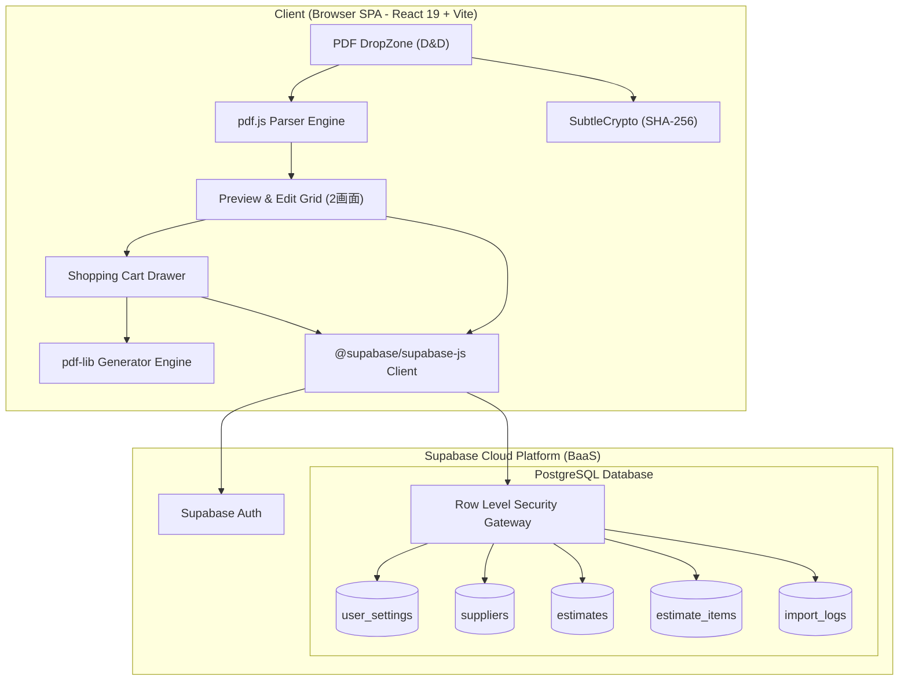
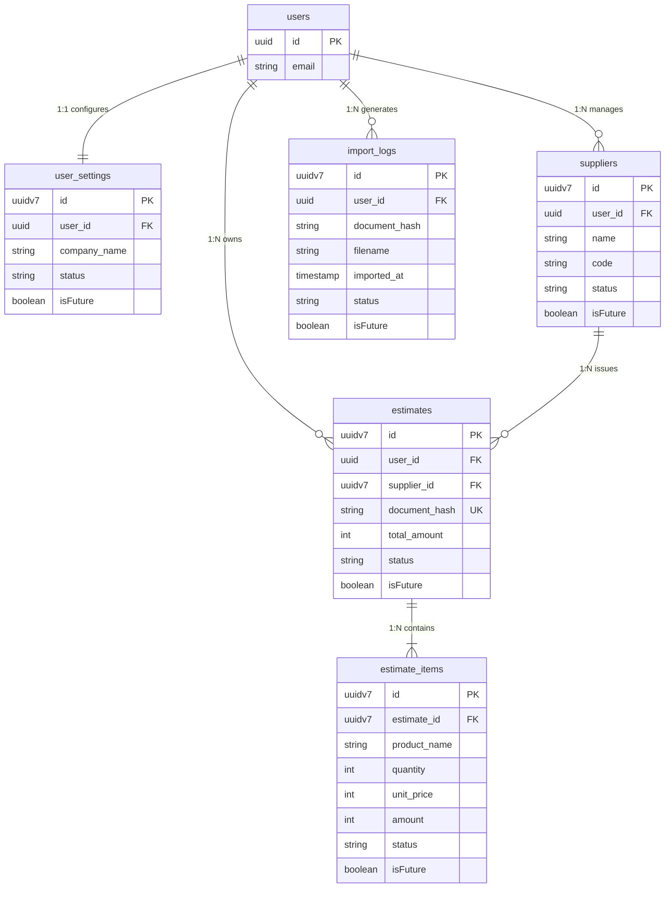
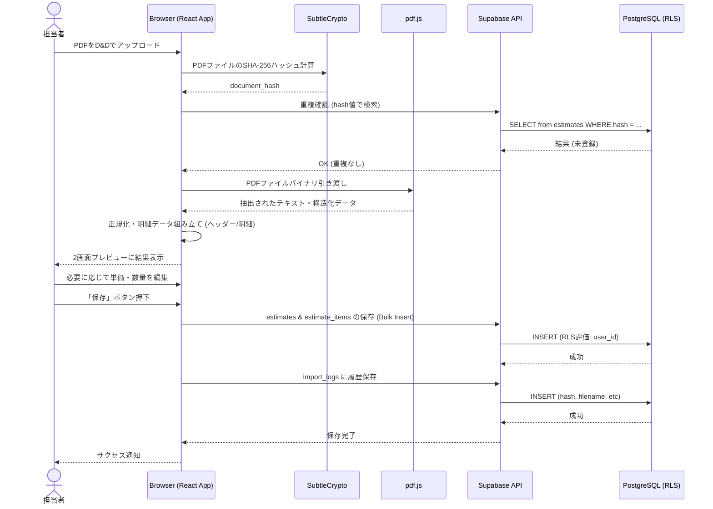

# Phase 3 モデリング・図解 (Modeling & Diagrams)

本ドキュメントは、Phase 2 のデータ設計および機能要件に基づき、システムのアーキテクチャ、データモデル（ER図）、および主要な処理フロー（シーケンス図）を可視化したものです。

## 1. システムアーキテクチャ図

モダンなServerless SPA構成（React 19 + Vite）とSupabase（BaaS）を組み合わせたアーキテクチャです。機密性の高い見積書PDFはサーバーへ送信されず、すべてクライアント（ブラウザ）内で完結して解析処理が行われます。

## 2. エンティティ・リレーションシップ図 (ER図)

Phase 2 で定義されたデータスキーマの相関関係を示します。全テーブルにおいて `user_id` をキーとしたRLSが適用され、テナント間のデータが完全に分離されます。

## 3. シーケンス図: PDFアップロード〜解析〜保存フロー

ユーザーが見積書PDFをアップロードし、クライアントサイドで解析して重複チェックを経たのち、Supabaseへデータを保存するまでの一連の処理フローです。

