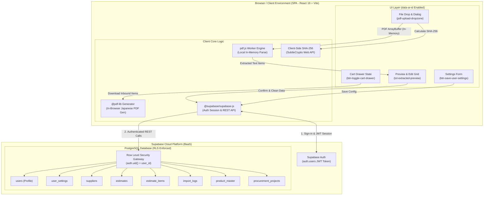
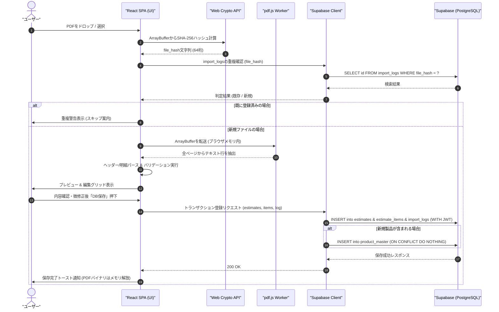
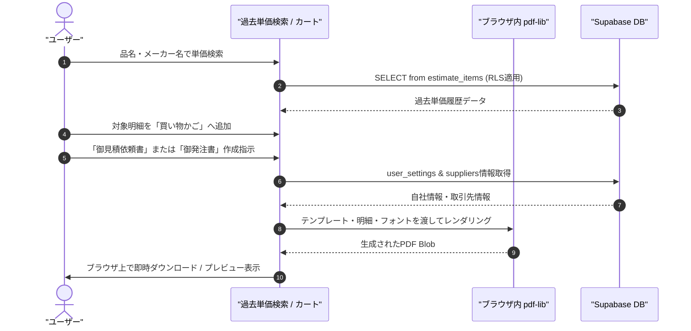
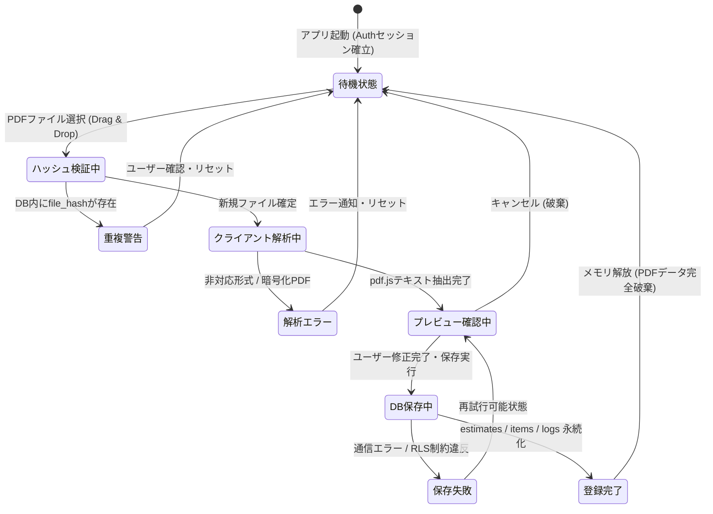
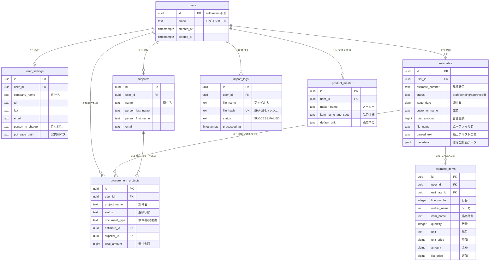

# Phase 3: モデリング・図解 (Modeling & Architecture)

## 【背景・目的】
Phase 1要件定義およびPhase 2で確定した不変ID・型安全データ設計に基づき、Mermaid構文を用いてWeb SPA版システム全体構成、クライアントサイドPDF解析フロー、Supabase連携シーケンス、RLSアクセス制御境界、および状態遷移を視覚化し、アーキテクチャの整合性を検証・確定する。

---

## 1. Web SPA システム全体構成 / コンポーネント図

元PDFバイナリを一切サーバーやクラウドストレージへ送信せず、ブラウザ内（`pdf.js`）で解析を完結させた上で、構造化データのみを直接Supabase（PostgreSQL/Auth）へ送受信するゼロサーバー（Serverless SPA）構成とする。

---

## 2. 処理フロー / シーケンス図

### 2.1 PDF取り込み・解析・Supabase保存シーケンス (PBI-002, PBI-003, PBI-004)

### 2.2 帳票生成・カートフローシーケンス (PBI-005, PBI-006)

---

## 3. 状態遷移図 (見積書取り込み・パースライフサイクル)

---

## 4. エンティティERモデリング図 (PostgreSQL / Supabase Schema)

## Loop 22 差分セクション (抽出結果のマークダウン出力とAI連携)

本ループ（抽出結果のMarkdown出力機能）は、PDF抽出結果をUI層からテキスト化（Markdownフォーマット）してクリップボードにコピーする機能であり、データの流れや状態遷移、エンティティ関係のモデル（アーキテクチャ）への影響はありません。
そのため、本フェーズ（モデリング・図解）におけるシステム構成図、シーケンス図、ステートマシン図、ER図への変更・追加は発生しません。
