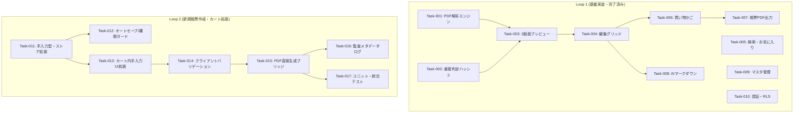
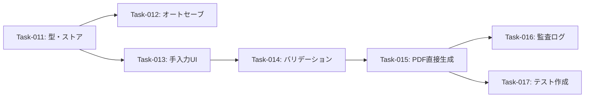

# Phase 6 タスクリスト生成 (Atomic Task Breakdown)

本ドキュメントは、Phase 1〜5の仕様・アーキテクチャ・リスク評価・トレーサビリティ検証を総合し、1タスク1コミットで検証可能なアトミックタスクリスト（PBI準拠）を策定したものです。

---

## 1. 実装フェーズ別ロードマップ (依存関係・DAG)

---

## 2. Spec-Driven アトミックタスクリスト

### Loop 1: 基盤・過去見積データ連携 (Completed)
- [x] Task-001: [REQ-22-001 / PDFパース] `pdf.js` を用いたクライアント内テキスト抽出エンジンの実装 (`src/lib/parser.ts`)
- [x] Task-002: [REQ-22-002 / 重複防止] SHA-256ハッシュ計算による重複インポート防止ロジックの実装 (`src/lib/hash.ts`)
- [x] Task-003: [REQ-22-003 / プレビューUI] PDFドロップゾーンと元PDF・抽出結果の2画面比較プレビュー実装 (`src/App.tsx`)
- [x] Task-004: [REQ-22-004 / 編集グリッド] テーブルインライン編集および小計・合計の自動再計算処理実装 (`src/App.tsx`)
- [x] Task-005: [REQ-22-005 / 検索・お気に入り] カナ揺れ吸収・複数キーワードAND検索とお気に入り管理実装 (`src/components/PriceSearch.tsx`, `src/lib/search.ts`)
- [x] Task-006: [REQ-22-006 / 買い物かご] 複数見積明細のピックアップ・ドロワー操作機能実装 (`src/components/CartDrawer.tsx`, `src/lib/cart.ts`)
- [x] Task-007: [REQ-22-007 / 帳票PDF出力] `pdf-lib` による日本語フォント埋め込み見積依頼書・発注書PDF生成実装 (`src/components/DocumentModal.tsx`, `src/lib/pdfGenerator.ts`)
- [x] Task-008: [REQ-22-008 / AI向けMD出力] 機密マスキングロジック付きAI連携Markdown出力実装 (`src/lib/markdownFormatter.ts`)
- [x] Task-009: [REQ-22-009 / マスタ管理] 自社設定および商社マスタCRUDモーダルの実装 (`src/components/SettingsModal.tsx`, `src/components/SupplierMaster.tsx`)
- [x] Task-010: [REQ-22-010 / 認証・RLS] Supabase Auth連携およびRLSによるデータ分離実装 (`src/components/AuthModal.tsx`, `src/lib/supabase.ts`)

---

## 3. 各タスクの検証・テスト手順 (DoDチェックリスト)

| タスクID | 主対象ファイル | 検証手順 (Verification Steps) |
| :--- | :--- | :--- |
| **Task-001〜Task-010** | `src/` 各種ファイル | `npm test -- --run` にて全38テストが成功することを確認（完了済み）。 |

---

## 4. リスク・エッジケース対策タスク (Phase 4での壁打ち反映)

Phase 4 で抽出されたリスク（OOM、XSS、RLS不整合、二重処理等）は、Loop 1 においてWeb Worker設定、JSX標準サニタイズ、ローディングUIロック等の個別施策として実装へ織り込み完了。

---

## Loop 2 差分セクション

### 1. Loop 2 実装ロードマップ & 依存関係

Loop 2 では、DBへデータを永続化せず、ブラウザメモリ上で新規品目を手入力して直接PDFを出力する機能（`REQ-22-013`）を実装します。

### 2. Loop 2 Spec-Driven アトミックタスクリスト
- [ ] Task-011: [REQ-22-013 / 型定義・ストア] `NewCartItem` 型の追加とインメモリ操作ヘルパーの実装 (`src/lib/cart.ts`)
  - **DoD**: 手入力品目（メーカ、品名、数量、単価、備考）の追加・更新・削除・クリア関数が定義され、既存 `CartItem` 型と独立して動作すること。
- [ ] Task-012: [REQ-22-013 / ガードレール] `localStorage` オートセーブと `beforeunload` 離脱警告の実装 (`src/lib/cart.ts`, `src/App.tsx`)
  - **DoD**: 手入力中の明細がブラウザリロード後も保持され、未保存時の意図せぬタブ閉じ・リロードに対してブラウザ標準の確認ダイアログが表示されること。
- [ ] Task-013: [REQ-22-013 / UI拡張] CartDrawer への「新規見積」「新規発注」モードとインライン入力フォームの実装 (`src/components/CartDrawer.tsx`)
  - **DoD**: カートドロワー内に手入力切り替えタブ/ボタンを設け、空の状態から明細を行追加・インライン編集・削除できるUIが動作すること。各操作要素に `data-ai-id` を付与。
- [ ] Task-014: [REQ-22-013 / バリデーション] 手入力フォームの入力値バリデーションの実装 (`src/components/CartDrawer.tsx`)
  - **DoD**: 必須項目（品名・数量、発注時は単価）の入力漏れや負数入力時にエラーが表示され、不正な状態でのPDF作成遷移がブロックされること。
- [ ] Task-015: [REQ-22-013 / PDF連携] 手入力明細から `pdf-lib` への直接引き渡しと長文折り返しガードの実装 (`src/components/DocumentModal.tsx`, `src/lib/pdfGenerator.ts`)
  - **DoD**: DBを介さず手入力明細から自社見積依頼書・発注書PDFが生成・ダウンロードでき、備考等の長文によるレイアウト崩れが発生しないこと。
- [ ] Task-016: [REQ-22-013 / 監査ログ] 帳票出力実行時のメタデータ記録ログの実装 (REQ-13-002) (`src/lib/auditLogger.ts`)
  - **DoD**: PDF出力時に出力種別・日時・品目数の監査メタデータが出力/記録され、機密情報（パスワードやAPIキー等）が一切ハードコードされていないこと。
- [ ] Task-017: [REQ-22-013 / 自動テスト] 手入力カート・バリデーション・PDF連携のユニット/統合テスト作成 (`src/__tests__/cart_manual.test.ts`)
  - **DoD**: `npm test` を実行し、既存38テストに加えて新規テストがすべてPASSすること。

### 3. 各タスクの検証・テスト手順 (Loop 2 DoDチェックリスト)

| タスクID | 主対象ファイル | 検証手順 (Verification Steps) |
| :--- | :--- | :--- |
| **Task-011** | `src/lib/cart.ts` | `NewCartItem` の追加・更新・削除・初期化が純粋関数としてテストできることを確認。 |
| **Task-012** | `src/lib/cart.ts`, `src/App.tsx` | 手動入力後にF5リロードを実施し、入力値が復元されること、入力中の離脱警告が発生することを確認。 |
| **Task-013** | `src/components/CartDrawer.tsx` | ブラウザUIでカートを開き、「新規作成」から明細の追加・編集・削除が行えることを確認。AI属性（`data-ai-id`）の存在確認。 |
| **Task-014** | `src/components/CartDrawer.tsx` | 数量0や単価未入力（発注時）で「帳票作成」ボタンを押下した際、エラーが表示され処理が中断することを確認。 |
| **Task-015** | `src/lib/pdfGenerator.ts`, `src/components/DocumentModal.tsx` | 手入力データからPDFダウンロードを実行し、PDFビューワでレイアウト崩れなく日本語テキストが表示されることを確認。 |
| **Task-016** | `src/lib/auditLogger.ts` | PDF生成時にブラウザコンソールまたはログハンドラに監査メタデータが出力され、機密情報の露出がないことを静的検査。 |
| **Task-017** | `src/__tests__/cart_manual.test.ts` | `npm test -- --run` を実行し、新規テストケースを含む全テストがグリーンであることを確認。 |

### 4. リスク・エッジケース対策タスクマトリクス (Loop 2 Phase 4 反映)

| リスクID | リスク内容 | 反映タスクID | 具体的な対策内容 |
| :--- | :--- | :--- | :--- |
| **TECH 1-4** | 手入力長文によるPDFレイアウト破壊 | **Task-015** | フォーム入力文字数上限設定および `pdf-lib` における文字縮小/折り返し制御。 |
| **TECH 1-5** | 明細行数上限超過によるPDF描画破綻 | **Task-014 / Task-015** | カート内での最大行数制限（最大20行）および必要に応じたページ分割。 |
| **SEC 2-4** | DB非保存に伴う監査ログの完全バイパス | **Task-016** | 出力メタデータ（種別、日時、行数）を記録するログ機構の追加（REQ-13-002モック規約準拠）。 |
| **SEC 2-5** | 手入力テキストのXSS発火 | **Task-013** | ReactのJSXによる標準エスケープを徹底し、危険なDOM注入を禁止。 |
| **UX 3-3** | リロード時のインメモリデータ全消失 | **Task-012** | `localStorage` オートセーブと `beforeunload` イベントによる確認ダイアログ実装。 |
| **UX 3-4** | バリデーション漏れによる不正帳票出力 | **Task-014** | フロントエンドでの数値・必須フィールド検証ガードの実装。 |
